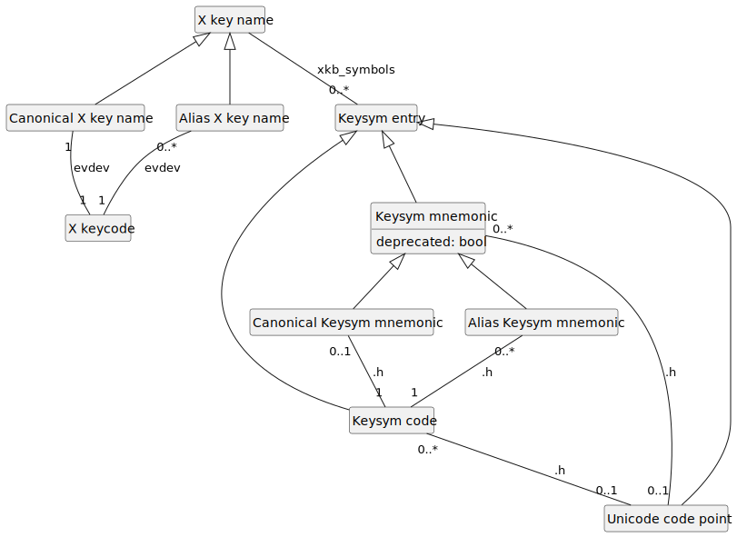

= XKB doc

Doc about USB keyboards under XKB governed systems (such as Wayland).

== Working of a USB keyboard
The examples are observations from my keyboard. 
I skipped some details that are unimportant for understanding the relationship between the keyboard and XKB (for example there is actually more than one mode for USB keyboards, which determine which usage code is sent).

.Keyboard signal transition
[[KB]]

* The keyboard sends a “usage code” down the wire. See USB https://usb.org/sites/default/files/hut1_21.pdf[“HID Usage Tables”] or Microsoft’s https://download.microsoft.com/download/1/6/1/161ba512-40e2-4cc9-843a-923143f3456c/translate.pdf[“USB HID to PS/2 Scan Code Translation Table].
** Examples. Pressing ESC sends usage code `0x29` (41); TAB sends usage code `0x2B` (43); the key next to it (with https://en.wikipedia.org/wiki/Keycap[keycap] `A` on my AZERTY keyboard) sends `0×14` (20); E sends `0×08` (8). Left Windows key sends `0×E3` (227), left Ctrl sends `0×E0` (224), left Alt sends `0×E2` (226), right Windows sends `0×E7` (231).
* The motherboard translates the usage code to a https://en.wikipedia.org/wiki/Scancode[scancode] that reaches the operating system.
** https://wiki.archlinux.org/title/Keyboard_input#Identifying_scancodes[Use] `showkey -s` to see those (https://manpages.ubuntu.com/manpages/focal/man1/showkey.1.html[approximately]), preferrably in a virtual console.
** Examples. Pressing ESC sends scancode `0x01` (1); TAB sends scancode `0x0F` (15); the key next to it sends `0x10` (16); E sends `0×12` (18). Left Windows key sends `0xE0 5B` (224 then 91), left Ctrl sends `0x1D 9D` (29 then 158), left Alt sends `0x38 B8` (56 then 200), right Windows sends `0xE0 EC` (224 then 92).
* The Linux kernel https://github.com/torvalds/linux/blob/master/include/uapi/linux/input-event-codes.h[transforms] this into a kernel https://wiki.archlinux.org/title/Map_scancodes_to_keycodes[keycode].
** Use `showkey` to see those, preferrably in a virtual console.
** Alternatively, use https://wiki.archlinux.org/title/Keyboard_input#Using_evtest[`evtest`] (https://cgit.freedesktop.org/evtest/tree/evtest.c[source]).
** Use `sudo evemu-describe` to see the whole conversion table. This program https://github.com/bentiss/evemu/blob/master/src/evemu.c#L351[maps] scancodes to (US?) https://gitlab.freedesktop.org/libevdev/libevdev/blob/master/include/linux/freebsd/input-event-codes.h[keycap] https://github.com/torvalds/linux/blob/master/include/uapi/linux/input-event-codes.h[names], such as KEY_TAB, KEY_Q.
** Examples. Pressing ESC corresponds to kernel keycode 1; TAB corresponds to kernel keycode 15; the key next to it corresponds to kernel keycode 16; E corresponds to keycode 18. Left Windows key corresponds to kernel keycode 125, left Ctrl to 29, left Alt to 56, right Windows to 126.
** AFAIK, these kernel keycodes are Linux specific (in the sense that I don’t know of another system that uses the same mapping from scancode to integer).
* Wayland (using libxkbcommon) maps those kernel keycodes to https://www.x.org/releases/current/doc/xproto/x11protocol.html#Keyboards[X keycodes], https://cgit.freedesktop.org/xorg/driver/xf86-input-evdev/tree/src/evdev.c#n280[with] X keycode = kernel keycode + 8 (https://unix.stackexchange.com/a/364652[thanks]).
** Use `wev` to see those (fails for some keys which are bound by Wayland, such as my left Windows key).
** Examples. Pressing ESC corresponds to X keycode 9; TAB corresponds to X keycode 23; the key next to it corresponds to X keycode 24; E corresponds to X keycode 26. Left Ctrl key corresponds to X keycode 37, left Alt to 64, right Windows to 134.
* X mapping sources (files and libraries) permit to associate these X keycodes to keysym codes, keysym mnemonics and Unicode code points (see below).

These translations from kernel to X keycodes to X key names is https://github.com/xkbcommon/libxkbcommon/blob/master/tools/interactive-wayland.c#L47[also called] “evdev keycodes” to “evdev XKB keycode”, https://xkbcommon.org/doc/current/md_doc_keymap_format_text_v1.html#autotoc_md22[or] “hardware/evdev scancodes” to “xkb keycodes”, https://gitlab.freedesktop.org/xkeyboard-config/xkeyboard-config/blob/master/keycodes/evdev[or] “evdev scancodes” to “something resembling xfree86 keycodes”.

== Mappings
The system file `evdev` maps X keycodes to X key names; local configuration files map X key names to keysym entries; and the system file `xkbcommon-keysyms.h` maps (mainly) keysym mnemonics to keysym codes and Unicode code points. See figure <<XM>> and read below for details.

.X mappings
[[XM]]

 
* To the X keycodes https://gitlab.freedesktop.org/xkeyboard-config/xkeyboard-config/blob/master/keycodes/evdev[correspond] X key names.
** A given X key name corresponds to exactly one X keycode.
A given X keycode corresponds to one or more X key name (through aliases); for example, both the `<AC12>` and `<BKSL>` X key names map to X keycode 51.
** Examples. `<ESC>` maps to X keycode 9, `<TAB>` to X keycode 23, `<AD01>` to 24, `<AD03>` to 26, `<LWIN>` to 133, `<LCTL>` to 37, `<LALT>` to 64, `<RWIN>` to 134.
** https://gitlab.freedesktop.org/xkeyboard-config/xkeyboard-config/tree/master/keycodes[Other files] define https://gitlab.freedesktop.org/xkeyboard-config/xkeyboard-config/blob/master/keycodes/aliases[more] (or https://gitlab.freedesktop.org/xkeyboard-config/xkeyboard-config/blob/master/keycodes/sun[different]) mappings.
** Some of the X keycodes in the `evdev` file are https://gitlab.freedesktop.org/xkeyboard-config/xkeyboard-config/blob/master/.gitlab-ci/generate-evdev-keycodes.py[generated] from the kernel keycodes.
* The X key names are associated, through local “symbol” https://xkbcommon.org/doc/current/keymap-text-format-v1.html#the-xkb_symbols-section[configuration files] (more generally, through a https://github.com/xkbcommon/libxkbcommon/blob/master/doc/introduction-to-xkb.md[keymap]), to keysym entries, each being a keysym mnemonic or a Unicode code point (UCP) or a keysym code.
** For example, the “link:https://gitlab.freedesktop.org/xkeyboard-config/xkeyboard-config/blob/master/symbols/us#L90[English (US, intl., with dead keys)]” xkb layout (together with the https://gitlab.freedesktop.org/xkeyboard-config/xkeyboard-config/blob/master/symbols/pc[common] mappings loaded from `rules/evdev`?) maps `<ESC>` to `Escape`, `<TAB>` to `Tab` and `ISO_Left_Tab`, `<AD01>` to `q`, `Q`, `adiaeresis` and `Adiaeresis`, `<AD03>` to `e`, `E`, `eacute` and `Eacute`, `<LWIN>` to `Super_L`, `<LCTL>` to `Control_L`, `<LALT>` to `Alt_L` and `Meta_L`, `<RWIN>` to `Super_R`.
** The “link:https://gitlab.freedesktop.org/xkeyboard-config/xkeyboard-config/blob/master/symbols/fr#L120[French (alt.)]” xkb layout maps `<AD01>` to `a`, `A`, `ae` and `AE` and maps `<AE04>` to `apostrophe`, `4`, `braceleft` and keycode 0×1002014 (itself implicitly associated to U+2014, em dash, see below).
** The “link:https://gitlab.freedesktop.org/xkeyboard-config/xkeyboard-config/blob/master/symbols/fr#L417[French (BEPO)]” xkb layout maps `<AC08>` to `s`, `S`, `ssharp` and U+1E9E LATIN CAPITAL LETTER SHARP S (ẞ).
** Some of the https://gitlab.freedesktop.org/xkeyboard-config/xkeyboard-config/blob/master/symbols/inet[associations] between X key names (of the form `<Ixxx>`) and keysym mnemonics are https://gitlab.freedesktop.org/xkeyboard-config/xkeyboard-config/blob/master/.gitlab-ci/generate-evdev-keysyms.py[generated] from the kernel keycodes.
* The `https://github.com/xkbcommon/libxkbcommon/blob/master/include/xkbcommon/xkbcommon-keysyms.h[xkbcommon-keysyms.h]` file maps keysym mnemonics and some UCPs to keysym codes (also called keysym link:https://www.x.org/releases/current/doc/xproto/x11protocol.html#keysym_encoding[values]).
** The file maps each keysym mnemonic (prefixed with `XKB_KEY_`) to a single keysym code. Some of these keysym mnemonics are deprecated. Conversely, not every keysym codes are associated to a keysym mnemonic: some are associated to none; some to more than one; for, example, both the “dead_tilde” and “dead_perispomeni” (non deprecated) keysym mnemonics map to 0×FE53.
** The file explicitly maps some keysym mnemonics to UCPs. Thus, a given keysym mnemonic is mapped to zero or one UCP. Conversely, not every UCP maps to a single keysym mnemonic, and of course, many UCPs are not mapped to any keysym mnemonic, thus, a given UCP is mapped to zero, one or more keysym mnemonics; for example, both the _space_ and _KP_space_ keysym mnemonics (with corresponding keysym codes 0×0020 and 0×FF80) map to UCP U+20. However, a UCP is mapped to at most one keysym mnemonic that is not marked as “more specific” (such as _KP_space_) or as deprecated.
** The file also describes an implicit mapping from any UCP _u_ (at least 0×100) to keysym code 0×1000000 + _u_.
** The file header indicates that its keysym codes are defined in the X Window System Protocol standard https://www.x.org/releases/current/doc/xproto/x11protocol.html#keysym_encoding[Appendix A], but the file contains new keysym codes that are not in Appendix A, such as 0×1008124b, to which `XF86CameraAccessEnable` is mapped, or 0×FE8D, to which
https://gitlab.freedesktop.org/xorg/proto/xorgproto/commit/b11152992d689e2f6a7d0d8c0a76d2644c52e15b[`dead_hamza`] is mapped (and which is also not defined in https://www.x.org/releases/current/doc/kbproto/xkbproto.html#new_keysyms["The X Keyboard Extension: Protocol Specification", Appendix C]).
** The file changes https://github.com/xkbcommon/libxkbcommon/commits/master/include/xkbcommon/xkbcommon-keysyms.h[frequently]. The one from the https://packages.debian.org/bookworm/amd64/libxkbcommon-dev/filelist[debian bookworm] distribution, apparently version 1.5.0-1, is identical to version https://raw.githubusercontent.com/xkbcommon/libxkbcommon/xkbcommon-1.5.0/include/xkbcommon/xkbcommon-keysyms.h[1.5.0] from commit https://github.com/xkbcommon/libxkbcommon/commit/7062ab[7062ab], and https://github.com/xkbcommon/libxkbcommon/compare/7062ab..238d13[differs] from the one in commit https://github.com/xkbcommon/libxkbcommon/commit/238d132406d8dc1123cbcaf68ab12d34c505e7e4[238d13].
** Examples. The keysym mnemonic `Escape` is mapped to 0×FF1B and UCP U+1B ESCAPE, `Tab` to 0×FF09 and UCP U+9 CHARACTER TABULATION, `ISO_Left_Tab` to 0×FE20 (and no UCP), `q` to 0×71 and UCP U+71 LATIN SMALL LETTER Q, `Q` to 0×51 and UCP U+51 LATIN CAPITAL LETTER Q, `adiaeresis` to 0×E4 and UCP U+E4 LATIN SMALL LETTER A WITH DIAERESIS, `Adiaeresis` to 0×C4 and UCP U+C4 LATIN CAPITAL LETTER A WITH DIAERESIS, `a` to 0×61, `A` to 0×41, `ae` to 0×E6, `AE` to 0×C6, `e` to 0×65, `E` to 0×45, `eacute` to 0×E9, `Eacute` to 0×C9, `s` to 0×73, `S` to 0×53, `ssharp` to 0×DF (each with their corresponding UCP), `Super_L` to 0×FFEB, `Control_L` to 0×FFE3, `Alt_L` to 0×FFE9, `Meta_L` to 0×FFE7, `Super_R` to 0×FFEC (all of these without UCP).
** The correspondance between keysym codes and keysym mnemonics comes from the `https://gitlab.freedesktop.org/xorg/proto/xorgproto/blob/master/include/X11/keysymdef.h[keysymdef.h]`, `https://gitlab.freedesktop.org/xorg/proto/xorgproto/blob/master/include/X11/XF86keysym.h[XF86keysym.h]` and other files from xorgproto that use a slightly different format (and XK_ prefixes). The `libxkbcommon` library https://github.com/xkbcommon/libxkbcommon/blob/master/scripts/makeheader#L62-L66[includes] these files and https://github.com/xkbcommon/libxkbcommon/blob/master/scripts/update-keysyms[writes] `xkbcommon-keysyms.h`. Commit https://github.com/xkbcommon/libxkbcommon/commit/49690d936bf6cc6bf85058c1f0a545f0d5e37c77[49690d] (Sept 2023) updated the files `xkbcommon-keysyms.h` and `ks_tables.h` using the latest xorgproto at the time (referring to xorgproto commit https://gitlab.freedesktop.org/xorg/proto/xorgproto/commit/1c8128d72df22843a2022576850bc5ab5e3a46ea[1c8128]), which reflects “latest available keys from Linux kernel”, as discussed https://lists.freedesktop.org/archives/wayland-devel/2023-October/043121.html[here] (adds for example `XF86XK_CameraAccessEnable` to `XF86keysym.h`). The debian bookworm (https://packages.debian.org/bookworm/x11proto-dev[v2022.1-1]) https://gitlab.freedesktop.org/xorg/proto/xorgproto/blob/25f3278b/include/X11/keysymdef.h[version] comes from commit https://salsa.debian.org/xorg-team/proto/xorgproto/blob/xorgproto-2022.1-1/include/X11/keysymdef.h[25f3278b]. See issue https://github.com/xkbcommon/libxkbcommon/issues/433[#433] for help with interpretation.
** Also `libx11` uses https://gitlab.freedesktop.org/xorg/lib/libx11/blob/master/configure.ac#L258-278[these] xorgproto files to https://gitlab.freedesktop.org/xorg/lib/libx11/blob/master/src/util/makekeys.c[build] its `ks_tables.h` file, which is https://gitlab.freedesktop.org/xorg/lib/libx11/blob/master/src/StrKeysym.c[used] to define `XStringToKeysym`.

== Concepts
Here I define a few (hopefully) (reasonably) precise terms, in the context of the figures here above. Feel free to refer to those in your documentation of your own keyboard-and-X related libraries if you feel it helps.
For example, I used some of them in the https://github.com/oliviercailloux/keyboardd[Keyboardd] doc.
Some of these terms correspond to usage I have observed on sources pointed to here above, others are mine.

* _X keys_: the set of X key names (canonical and aliases) and corresponding X keycodes available on a system; typically read from an `evdev` file
* _Keysym mnemonics_: the set of keysym mnemonics available on a system, together with information per mnemonic (the keysym code it maps to, whether it is an alias or is deprecated, which UCP corresponds to it if any, …); typically read from a `xkbcommon-keysyms.h` file
* _UCP by keysym code_: maps keysym codes to their corresponding UCP (for those codes which have one)
* _Keyboard map_: a subset of X key names, each mapped to a list of keysym entries (where a keysym entry is either a keysym mnemonic, a UCP or a keysym code, see above); typically defined in a set of local “symbol” configuration files
* _Visible keyboard map_: a subset of X key names, each mapped to a list of representations
* _Physical keyboard_: a set of physical keys; each with a position, a possibly complex shape, and a name, either an X key name that corresponds to the X keycode that the key sends when pressed, or just a name that describes the key in case the key does not send an X keycode (such as, generally, the “Fn” key)
* _Rectangular keyboard_: a physical keyboard whose keys all have a rectangular shape and are aligned on rows that all have the same height (thus, all keys have the same height)
* _Functional keyboard_: a physical keyboard that also associates each key with a (possibly empty) list of representations

== See also
* https://who-t.blogspot.com/2020/09/user-specific-xkb-configuration-putting.html[] (huge thanks)
* https://github.com/SmartLayer/MathLingua-Layout

== More info to integrate
The following pointers might be useful. I did not integrate this information to this doc “yet” (and probably will not, but help is welcome).

* https://github.com/xkbcommon/libxkbcommon/blob/238d132406d8dc1123cbcaf68ab12d34c505e7e4/include/xkbcommon/xkbcommon.h#L168-L204[impl] of `libxkbcommon xkb_keysym_get_name`, `xkb_keysym_from_name`, `xkb_keysym_to_utf8`, `xkb_keymap_num_layouts_for_key` and so on.
* https://who-t.blogspot.com/2021/01/auto-updating-xkb-for-new-kernel.html[auto-updating-xkb-for-new-kernel]
* https://gitlab.freedesktop.org/xorg/lib/libx11/-/blob/master/src/xkb/XKBBind.c[impl] of `XkbKeycodeToKeysym`, `XKeycodeToKeysym`, `XKeysymToKeycode` and more complicated functions (https://gitlab.freedesktop.org/xorg/lib/libx11/-/blob/master/src/KeyBind.c[older one]; some related https://github.com/mirror/libX11/blob/master/src/xkb/XKBlibint.h[headers]). https://gitlab.freedesktop.org/xorg/lib/libx11/blob/master/src/StrKeysym.c[Impl] of `XStringToKeysym` only.

On my Debian bookworm system:

* https://packages.debian.org/bookworm/libxkbcommon-x11-0[libxkbcommon-x11-0] (mandatory): “This package provides an add-on library called xkbcommon-x11, to support creating keymaps with the XKB X11 protocol, by querying the X server directly.”
* https://packages.debian.org/bookworm/libxkbcommon0[libxkbcommon0] (mandatory)
* libx11-6
* libx11-data
* libx11-dev, requiring https://packages.debian.org/bookworm/all/x11proto-dev/filelist[x11proto-dev], containing `/usr/include/X11/keysymdef.h`, but non mandatory
* I can load the "X11" library and call XStringToKeysym("KP_Space"). “XKeycodeToKeysym predates the XKB extension. If you want to lookup a KeySym while using XKB you have to use XkbKeycodeToKeysym.” -- man https://linux.die.net/man/3/xstringtokeysym[xstringtokeysym]
* man https://linux.die.net/man/3/xkbkeycodetokeysym[xkbkeycodetokeysym]

